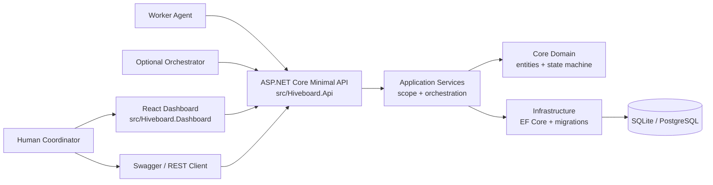
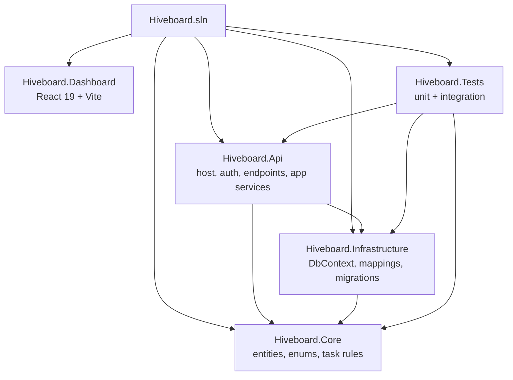
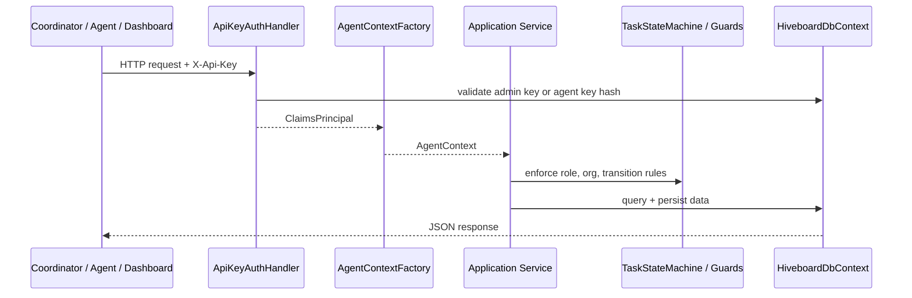
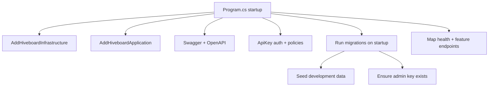
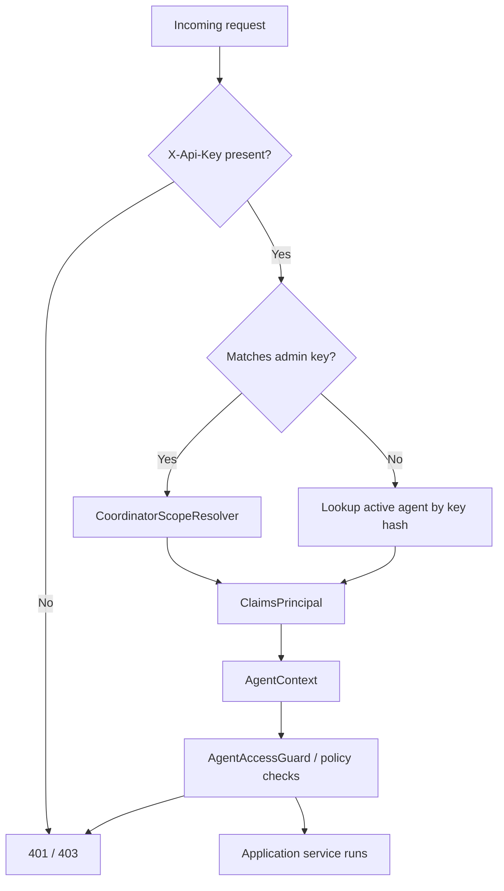
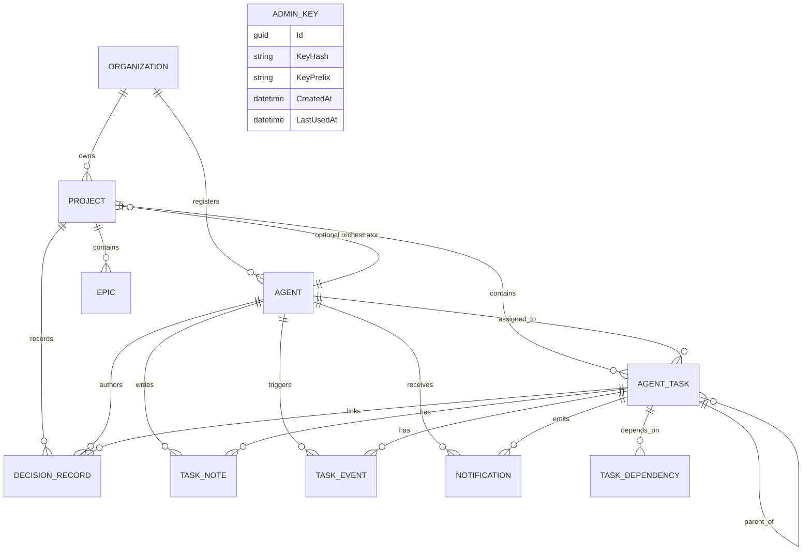
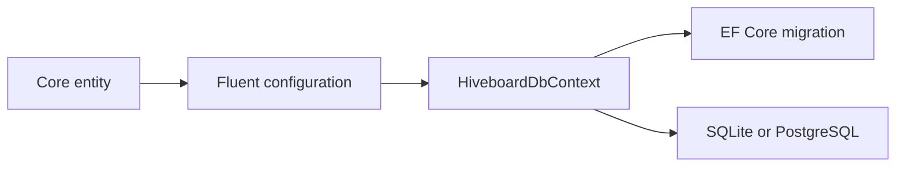
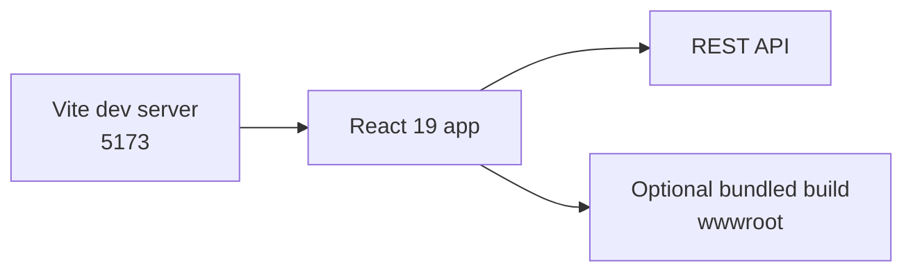
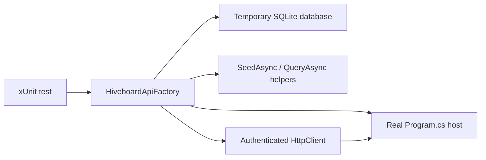

# Hiveboard Architecture Guide

This guide is the fastest way to build a correct mental model of Hiveboard before you start changing code.

## 1. System In One Screen

### What is true today

| Area | Current reality |
|---|---|
| Primary product surface | The REST API is the real control plane today. |
| Frontend state | The React app exists and is useful for orientation, but it is intentionally thin. |
| Coordination model | Human coordinator first, optional orchestrator second, workers execute assigned tasks. |
| Persistence | EF Core with SQLite by default and PostgreSQL as an alternate provider. |
| Auth | A bootstrap admin key acts as the coordinator credential; agents use their own API keys. |

## 2. Monorepo Map

### Directory cheat sheet

| Path | Why it exists | Open this first when you want to... |
|---|---|---|
| [`src/Hiveboard.Api`](./src/Hiveboard.Api) | API host, auth, endpoint registration, application services | Add or change HTTP behavior |
| [`src/Hiveboard.Core`](./src/Hiveboard.Core) | Domain entities, enums, task workflow rules | Change business rules or shared models |
| [`src/Hiveboard.Infrastructure`](./src/Hiveboard.Infrastructure) | EF Core context, configurations, migrations, seeding | Change persistence or provider behavior |
| [`src/Hiveboard.Dashboard`](./src/Hiveboard.Dashboard) | Standalone React dashboard | Change frontend behavior or styling |
| [`tests/Hiveboard.Tests`](./tests/Hiveboard.Tests) | Integration and unit coverage | Verify behavior or add regressions |

## 3. Request Path

### What each layer is responsible for

| Layer | Owns | Does not own |
|---|---|---|
| Endpoint modules | Route shape, auth requirements, OpenAPI metadata | Business workflow details |
| Application services | Cross-entity orchestration, scope validation, persistence coordination | Raw HTTP auth parsing |
| Core | Entity shape, enums, task transition rules | EF Core mappings or HTTP concerns |
| Infrastructure | Database provider setup, mappings, migrations, seed data | Endpoint decisions |

## 4. Composition Root

The entire backend is assembled in [`src/Hiveboard.Api/Program.cs`](./src/Hiveboard.Api/Program.cs).

### Startup notes that matter

| Concern | Current behavior |
|---|---|
| Database provider | `DatabaseProvider` switches between SQLite and PostgreSQL in [`ServiceRegistration.cs`](./src/Hiveboard.Infrastructure/ServiceRegistration.cs). |
| Migrations | Applied automatically on API startup. |
| Seed data | Development only, via `HiveboardDbSeeder`. |
| Admin key bootstrap | Loaded from `HIVEBOARD_ADMIN_KEY` if present, otherwise generated and stored hashed. |
| API discoverability | Swagger is enabled in development. |

## 5. Auth And Scope Model

### Key auth files

| File | Responsibility |
|---|---|
| [`ApiKeyAuthHandler.cs`](./src/Hiveboard.Api/Auth/ApiKeyAuthHandler.cs) | Validates admin keys and agent keys, then emits claims. |
| [`AdminKeyProvider.cs`](./src/Hiveboard.Api/Auth/AdminKeyProvider.cs) | Creates, rotates, hashes, and validates the coordinator/admin key. |
| [`CoordinatorScopeResolver.cs`](./src/Hiveboard.Api/Application/CoordinatorScopeResolver.cs) | Maps the coordinator credential to the active organization in self-hosted MVP mode. |
| [`AgentContextFactory.cs`](./src/Hiveboard.Api/Application/AgentContextFactory.cs) | Converts claims into a typed per-request `AgentContext`. |
| [`AgentAccessGuard.cs`](./src/Hiveboard.Api/Application/AgentAccessGuard.cs) | Central place for role and organization-scope checks inside application services. |

### Practical rule of thumb

| Actor | What it can usually do |
|---|---|
| Coordinator/admin key | Full control-plane actions, including agent management and review-side transitions |
| Configured project orchestrator | Project-level coordination actions where explicitly allowed |
| Worker agent | Read scoped data and move only its assigned tasks through worker-side transitions |

## 6. Domain Model

### Most important aggregates

| Concept | Why it matters |
|---|---|
| `Organization` | Top-level tenant boundary for all meaningful access checks. |
| `Project` | Main work container; may optionally point at an orchestrator agent. |
| `AgentTask` | Central workflow aggregate with assignment, dependency, audit, and notification side effects. |
| `TaskDependency` | Blocks task start until upstream work is done. |
| `TaskEvent` | Audit trail for assignment and status changes. |
| `Notification` | Delivery mechanism for assignment, blocked, review, and dependency-resolved signals. |
| `AdminKey` | Persisted coordinator credential metadata not described in the original PRD but present in the current codebase. |

## 7. Feature Slice Map

| Slice | Endpoints | Services / rules | Main tests |
|---|---|---|---|
| Agents | [`AgentEndpoints.cs`](./src/Hiveboard.Api/Endpoints/AgentEndpoints.cs) | `AgentApplicationService`, `AgentKeyLifecycle` | `AgentLifecycleIntegrationTests`, `AgentKeyLifecycleTests` |
| Admin key | [`AdminKeyEndpoints.cs`](./src/Hiveboard.Api/Endpoints/AdminKeyEndpoints.cs) | `AdminKeyProvider` | `AdminKeyProviderTests`, `AuthIntegrationTests` |
| Projects | [`ProjectEndpoints.cs`](./src/Hiveboard.Api/Endpoints/ProjectEndpoints.cs) | `ProjectApplicationService` | `ProjectEpicCrudIntegrationTests`, `TenantScopingIntegrationTests` |
| Epics | [`EpicEndpoints.cs`](./src/Hiveboard.Api/Endpoints/EpicEndpoints.cs) | `EpicApplicationService` | `ProjectEpicCrudIntegrationTests` |
| Dependencies | [`DependencyEndpoints.cs`](./src/Hiveboard.Api/Endpoints/DependencyEndpoints.cs) | `DependencyApplicationService`, `DependencyService` | `DependencyManagementIntegrationTests` |
| Tasks | [`TaskEndpoints.cs`](./src/Hiveboard.Api/Endpoints/TaskEndpoints.cs) and [`TaskStatusEndpoints.cs`](./src/Hiveboard.Api/Endpoints/TaskStatusEndpoints.cs) | `TaskApplicationService`, `TaskStateMachine` | `TaskCrudAssignmentIntegrationTests`, `TaskStatusWorkflowIntegrationTests`, `TaskStateMachineTests` |

## 8. Task Workflow

[`src/Hiveboard.Core/Services/TaskStateMachine.cs`](./src/Hiveboard.Core/Services/TaskStateMachine.cs) is the main source of truth for task transitions.

```mermaid
stateDiagram-v2
    [*] --> Backlog
    Backlog --> Assigned: coordinator/orchestrator assigns worker
    Assigned --> InProgress: assigned worker starts; dependencies done
    InProgress --> InReview: assigned worker requests review
    InProgress --> Blocked: assigned worker sets blocked reason
    InProgress --> Done: assigned worker completes directly
    InReview --> InProgress: coordinator/orchestrator sends back
    InReview --> Done: coordinator/orchestrator approves
    Blocked --> Assigned: coordinator/orchestrator unblocks
```

### Workflow side effects implemented in `TaskApplicationService`

| Event | Side effect |
|---|---|
| Assignment | Creates a `TaskEvent` and `TaskAssigned` notification |
| Move to `InReview` | Notifies the coordinator and the configured project orchestrator |
| Move to `Blocked` | Notifies the coordinator and the configured project orchestrator |
| Move to `Done` | Notifies newly unblocked dependents and may auto-complete the parent task if all subtasks are done |

### Dependency graph rules live next to the workflow

[`src/Hiveboard.Core/Services/DependencyService.cs`](./src/Hiveboard.Core/Services/DependencyService.cs) owns dependency-specific validation:

| Rule | Behavior |
|---|---|
| Self dependency | Rejected |
| Cross-project dependency | Rejected |
| Duplicate dependency | Rejected |
| Circular dependency | Rejected with the detected cycle path |
| Graph query | Returns project-level nodes and edges for visualization |

## 9. Persistence Model

### Files to know

| File | Why it matters |
|---|---|
| [`HiveboardDbContext.cs`](./src/Hiveboard.Infrastructure/Data/HiveboardDbContext.cs) | Central EF Core entry point |
| [`Data/Configurations`](./src/Hiveboard.Infrastructure/Data/Configurations) | One mapping file per entity |
| [`Data/Migrations`](./src/Hiveboard.Infrastructure/Data/Migrations) | Schema history and provider-safe evolution |
| [`HiveboardDbSeeder.cs`](./src/Hiveboard.Infrastructure/Data/HiveboardDbSeeder.cs) | Development bootstrap data |

## 10. Frontend Reality

### What a new frontend contributor should know

| Concern | Current state |
|---|---|
| Main app entry | [`src/Hiveboard.Dashboard/src/App.tsx`](./src/Hiveboard.Dashboard/src/App.tsx) |
| Development mode | Run the Vite app standalone against the API |
| Bundling mode | `Hiveboard.Api.csproj` can run `npm install` and `npm run build:bundle` when `BuildDashboardAssets=true` |
| Product posture | The dashboard currently explains the coordinator-first model more than it implements the full control plane |

## 11. Testing Architecture

### Why the tests are useful for onboarding

| Test area | What it teaches you |
|---|---|
| `AuthIntegrationTests` | How the API key model behaves from the outside |
| `TenantScopingIntegrationTests` | Where organization isolation is enforced |
| `DependencyManagementIntegrationTests` | Dependency creation, removal, graph output, circular detection, and mutation authorization |
| `TaskCrudAssignmentIntegrationTests` | Normal task CRUD and assignment flow |
| `TaskStatusWorkflowIntegrationTests` | Transition rules, notifications, and auto-completion behavior |
| `TaskStateMachineTests` | The pure domain workflow without HTTP or EF noise |

## 12. Build And Run Modes

| Goal | Command |
|---|---|
| Restore | `dotnet restore Hiveboard.sln` |
| Build backend in this sandbox | `dotnet build Hiveboard.sln -p:BuildDashboardAssets=false` |
| Run backend tests in this sandbox | `dotnet test tests/Hiveboard.Tests/Hiveboard.Tests.csproj --no-restore -p:UseSandboxBuildWorkaround=true -p:BuildDashboardAssets=false` |
| Start API | `dotnet run --project src/Hiveboard.Api/Hiveboard.Api.csproj` |
| Start dashboard dev server | `npm run dev` from `src/Hiveboard.Dashboard` |
| Bundle dashboard into API | build API with `-p:BuildDashboardAssets=true` |

## 13. Where To Start When Making Changes

| If you need to... | Start here | Then check |
|---|---|---|
| Add a new endpoint | `Endpoints/` | matching `Application/` service, contracts, integration tests |
| Change who can do something | `ApiKeyAuthHandler`, `AgentAccessGuard`, auth policies in `Program.cs` | tenant-scope and auth tests |
| Change task workflow | `TaskStateMachine` | `TaskApplicationService`, workflow tests |
| Change schema | Core entity + EF configuration | migration, seeder, integration tests |
| Change dashboard behavior | `src/Hiveboard.Dashboard/src/App.tsx` | Vite config, API contract compatibility |
| Diagnose startup issues | `Program.cs` | infrastructure registration, appsettings, migrations |

## 14. First-Day Reading Order

1. [`README.md`](./README.md)
2. [`ARCHITECTURE.md`](./ARCHITECTURE.md)
3. [`src/Hiveboard.Api/Program.cs`](./src/Hiveboard.Api/Program.cs)
4. [`src/Hiveboard.Api/Application`](./src/Hiveboard.Api/Application)
5. [`src/Hiveboard.Core/Services/TaskStateMachine.cs`](./src/Hiveboard.Core/Services/TaskStateMachine.cs)
6. [`tests/Hiveboard.Tests/TaskStatusWorkflowIntegrationTests.cs`](./tests/Hiveboard.Tests/TaskStatusWorkflowIntegrationTests.cs)

If you understand those six stops, you understand the current shape of the system.
